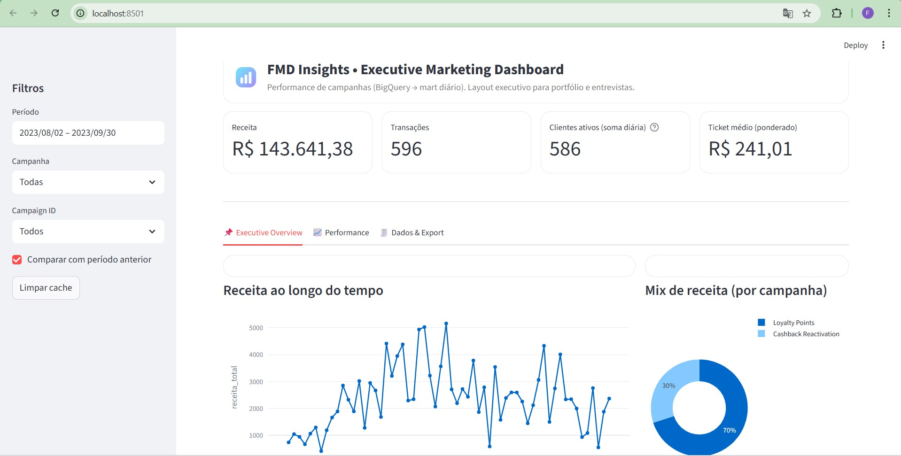
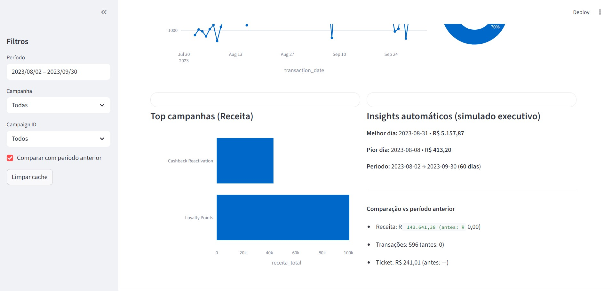
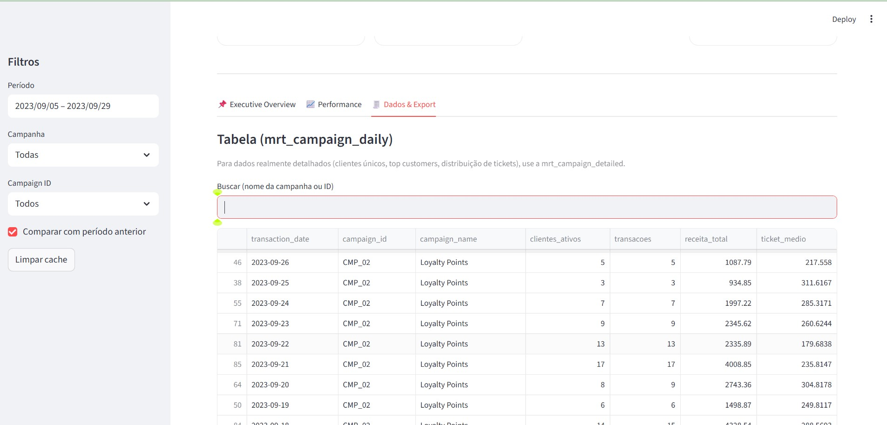

# 📊 Campaign Analytics Engine  
### FMD Insights • Executive Marketing Dashboard  

Motor analítico completo para avaliação de performance de campanhas, com controle explícito de qualidade, cardinalidade e modelagem de métricas executivas.

Projeto desenvolvido com foco em:

- Engenharia de métricas confiáveis  
- Controle de inflação numérica por joins  
- Modelagem orientada à decisão  
- Visualização executiva para portfólio  

---

# 🖥️ Dashboard Executivo (Streamlit)

## Executive Overview

## Performance

## Dados & Export

---

# 🏗️ Arquitetura Analítica

O projeto foi estruturado em camadas bem definidas.

---

## 🔹 1. Staging Layer

Tratamento e padronização dos dados brutos:

- Deduplicação com `ROW_NUMBER()`
- Exclusão de inconsistências temporais
- Padronização de tipos
- Seleção do registro mais recente

---

## 🔹 2. Quality Layer

Validações estruturais:

- Checagem de cardinalidade
- `COUNT(DISTINCT)` para auditoria
- Comparação pré e pós integração
- Identificação de duplicidades

---

## 🔹 3. Integration Layer

Integração controlada entre múltiplas fontes:

- `INNER JOIN` para relacionamentos obrigatórios
- `LEFT JOIN` para preservar base analítica
- Controle explícito de cardinalidade
- Agregações prévias antes de joins

### Riscos tratados

- N:N involuntário
- Inflação de receita
- Duplicidade por múltiplos eventos
- Premiações associadas incorretamente

---

## 🔹 4. Metrics Layer

Modelagem explícita de métricas executivas:

- Receita total
- Ticket médio ponderado
- Clientes ativos (soma diária)
- Comparação com período anterior
- Receita incremental simulada
- ROI simulado

Técnicas utilizadas:

- `SUM()`
- `GROUP BY`
- Window functions (`SUM() OVER`, `AVG() OVER`)
- Agregações controladas

---

## 🔹 5. Visualization Layer

Implementada em Streamlit conectando diretamente ao BigQuery.

Características:

- Layout executivo
- KPIs com variação percentual
- Filtros dinâmicos
- Análise temporal
- Ranking de campanhas
- Exportação CSV

---

# ⚠️ Problemas Simulados nos Dados

O dataset inclui falhas comuns de ambientes reais:

- Clientes duplicados no CRM
- Datas inconsistentes
- Eventos duplicados
- Premiações fora de regra
- Quebra de cardinalidade
- Métricas infladas por joins N:N

---

# 🛠️ Stack Técnica

## 🐍 Python
- Geração de dados sintéticos
- Streamlit
- Pandas
- Plotly
- Integração com BigQuery

## 🗄️ SQL
- CTEs
- Controle de cardinalidade
- `ROW_NUMBER()`
- `COUNT(DISTINCT)`
- Window functions
- Separação clara entre camadas

## ☁️ BigQuery
- Armazenamento analítico
- Consulta direta via client Python

---

# 📁 Estrutura do Repositório

campaign-analytics-engine/

├── app.py  
├── requirements.txt  
├── .gitignore  
├── README.md  

├── assets/  
│   ├── 01_overview.png.jpg  
│   ├── 02_performance.png.jpg  
│   └── 03_data_export.png.jpg  

├── data/  
│   └── raw/  

├── python/  
│   └── generate_data.py  

├── sql/  
│   ├── 01_staging.sql  
│   ├── 02_quality.sql  
│   ├── 03_integration.sql  
│   └── 04_metrics.sql  

---

# 🚀 Como Rodar o Projeto

1️⃣ Criar ambiente virtual  
python -m venv .venv  

2️⃣ Ativar ambiente (Windows)  
.venv\Scripts\activate  

3️⃣ Instalar dependências  
pip install -r requirements.txt  

4️⃣ Configurar autenticação Google Cloud  
gcloud auth application-default login  

5️⃣ Executar o dashboard  
streamlit run app.py  

---

# 📌 Observação

Todos os dados são sintéticos e foram criados exclusivamente para fins educacionais e demonstração técnica.

---

# 👤 Autoria

Projeto autoral desenvolvido como estudo aplicado de Analytics Engineering.

Reflete minha abordagem na estruturação de pipelines, controle de qualidade numérica e tradução de dados em decisões estratégicas.
